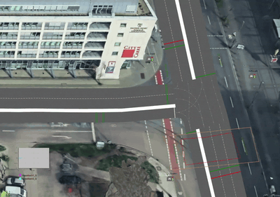
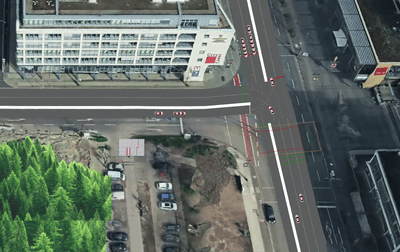
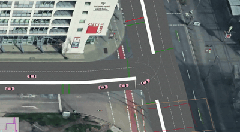

# 🚦 HasselfreeFlow: Multimodal Urban Traffic Simulation Engine

**Production-grade discrete-event and continuous spatial simulation evaluating geometric lane reduction, signal modulation, and continuous-flow redesign on the Hasselbachstraße corridor.**

<div align="center">

[](https://www.anylogic.com/)
[](https://www.java.com/)
[]()
[]()
[](LICENSE)

</div>

## 📌 Overview

The HasselfreeFlow Simulation Engine is a high-fidelity discrete-event and continuous spatial simulation developed to evaluate the operational and systemic impacts of merging the two turning lanes on the south side of Hasselbachstraße into a single lane at the Otto-von-Guericke-Straße intersection[cite: 1, 2]. In assessing this core capacity reduction, the model extends across the connected corridor to Bahnhofstraße to evaluate critical network spillover effects—including upstream queue propagation, rerouting feasibility, pedestrian crossing conflicts, on-street parking disturbances, and tram priority interactions[cite: 1, 2].

**Key highlights:**
- **Empirical Stochastic Modeling:** Empirical inter-arrival times derived from field surveys at Willy-Brandt-Platz / Hauptbahnhof mathematically fitted and validated via Chi-Square Goodness-of-Fit tests at $\alpha = 0.05$.
- **Petri Net Conceptual Architecture:** Pre-simulation formalization using Stochastic Petri Nets to isolate token flows, signal transitions, pedestrian conflicts, and avoid structural deadlocks prior to spatial deployment.
- **High-Fidelity Multimodal Kinematics:** Joint coordination of AnyLogic's Road Traffic, Pedestrian, and Process Modeling Libraries over a satellite-calibrated spatial topology.
- **Multi-Scenario Experimentation & 95% CI Validation:** Evaluated 100 independent 5-hour replications per scenario to disprove forced physical merging claims and identify continuous-flow optimizations.

---

## ⚠️ Data Availability & NDA Notice

**Please note:** Specific empirical datasets utilized to parameterize and validate this simulation—including high-resolution vehicle count registries, detailed municipal signal control timings, and transit schedule interaction protocols—were coordinated under Non-Disclosure Agreements (NDA) and institutional research provisions in cooperation with municipal partners in Magdeburg. 

Consequently, raw proprietary surveillance logs and unpublished operational records cannot be redistributed in this public repository. To ensure full scientific reproducibility, the model incorporates all mathematically abstracted parameters—such as fitted inter-arrival distributions (e.g., rate parameter $\lambda$), goodness-of-fit test statistics, routing split fractions, and measured spatial geometry tables.

---

### Simulation Logic Flow

```text
┌──────────────────────────┐      ┌──────────────────────────┐      ┌──────────────────────────┐
│   Field Data Analysis    │ ───► │   Petri Net Abstraction  │ ───► │   Kinematic Execution    │
│  (Exponential / Weibull) │      │  (Concurrency & Signals) │      │   (AnyLogic Multimodal)  │
└──────────────────────────┘      └──────────────────────────┘      └──────────────────────────┘
              │                                 │                                 │
              ▼                                 ▼                                 ▼
   Approach A (19.54s mean)            Vehicular Token Chains            Continuous Spatial Markup
   Approach B (55.19s mean)            Pedestrian Phasing Blocks         Road Traffic & Pedestrian Lib
   Tram & Parking Disturbances         Tram Priority Transitions         Independent Tram Signal Logic
```


## 📊 Core Competency

### Stochastic Modeling & Analytics

| Technique | Application |
| :--- | :--- |
| **Distribution Fitting & Hypothesis Testing** | Fitted inter-arrival times across Exponential, Weibull, and Lognormal models, verified via Chi-Square goodness-of-fit tests at $\alpha=0.05$ (Approach A: Exponential $\lambda=0.0512\text{ veh/s}$, $p=0.5888$; Approach B: Exponential $\lambda=0.0181\text{ veh/s}$, $p=0.0643$)[cite: 1]. |
| **Monte Carlo Replications** | Executed 100 independent simulation replications of 18,000 seconds (5 hours) per scenario to construct reliable 95% Confidence Intervals[cite: 1]. |
| **Paired Statistical Validation** | Evaluated differences between simulated and real-world metrics ($D = \text{Simulation} - \text{Real}$) using two-tailed t-distribution tests; verified zero inside the 95% CI for Queue Length, Delay, and Turning Time across all approaches[cite: 1]. |
| **Sensitivity Analysis** | Evaluated arrival-rate scaling multipliers across 0.25×, 0.75×, 1.00×, 1.25×, and 2.50× over 100 runs each to demonstrate monotonic and plausible queue and latency response curves[cite: 1]. |
| **Multimodal Disturbance Modeling** | Integrated stochastic on-street parking maneuvers (mean arrival: 336.89 s; mean departure: 329.30 s) and pedestrian crossing clearance times (P1: 14.00 s; P2: 13.82 s)[cite: 1]. |

### Simulation Architecture

| Component | Implementation |
| :--- | :--- |
| **Continuous Spatial Markup** | Geometrically scaled corridor network mapped across 13 measured road/lane segments (ranging from 4 m to 116 m) calibrated with Google Earth satellite overlay[cite: 1]. |
| **Multi-Library Discrete-Event Blocks** | Coordinated agent flows using AnyLogic Road Traffic Library (`CarSource`, `CarMoveTo`, `CarSink`), Pedestrian Library (`PedSource`, `PedWait`, `PedGoTo`), and Process Modeling Library[cite: 1]. |
| **Independent Transit Signaling** | Implemented a dedicated tram traffic light and detection logic decoupled from vehicular signal phases to ensure realistic, conflict-free tram network traversal[cite: 1]. |
| **Pedestrian-Vehicle Conflict Control** | Applied stopping logic at crosswalk interfaces ensuring vehicles yield to active pedestrian crossing phases and preventing spatial clipping[cite: 1]. |
| **Stochastic Routing Decision Trees** | Modeled directional splits directing 80% of vehicle flow toward Approach A (City Carré) and 20% toward Approach B (Hasselbachstraße)[cite: 1]. |

---

## 🧪 Experimental Scenarios & Performance Benchmarks

All scenarios were benchmarked using 100 independent Monte Carlo replications to determine system performance with 95% Confidence Intervals[cite: 1]:

| Scenario | Intervention Type | System Travel Time[cite: 1] | Delay on Hasselbach Str.[cite: 1] | Queue Length[cite: 1] | Strategic Finding[cite: 1] |
| :--- | :--- | :--- | :--- | :--- | :--- |
| **Base Model** | Dual-lane turning baseline | $99.02\text{ s}$ $[97.11, 100.93]$ | $30.98\text{ s}$ (Lane A) / $28.80\text{ s}$ (Lane B) | $3.80\text{ veh}$ (Lane A) / $1.30\text{ veh}$ (Lane B) | Empirically verified baseline conditions[cite: 1]. |
| **Exp 1: Lane Merge** | Physical capacity reduction (2 lanes to 1) | $157.35\text{ s}$ $[153.13, 161.57]$ | $53.94\text{ s}$ $[51.77, 56.10]$ | $6.52\text{ veh}$ $[6.13, 6.91]$ | **Disproved:** Travel time increases by 58%; induces severe bottleneck congestion[cite: 1]. |
| **Exp 2: Signal Modulation** | Operational isolation of pedestrian green | $142.07\text{ s}$ $[137.55, 146.59]$ | $51.19\text{ s}$ $[49.08, 53.30]$ | $5.73\text{ veh}$ $[5.41, 6.04]$ | **Stopgap:** Decreases intersection conflicts and improves throughput with minimal infrastructure cost[cite: 1]. |
| **Exp 3: Turn Restriction** | Access management (Left turn only, right turns rerouted) | $135.74\text{ s}$ $[133.26, 138.21]$ | $45.62\text{ s}$ $[43.61, 47.63]$ | $4.52\text{ veh}$ $[4.12, 4.91]$ | **Low-Cost Alternative:** Successfully redistributes traffic burden and shortens approach queues[cite: 1]. |
| **Exp 4: Roundabout** | Structural continuous-flow conversion | $48.99\text{ s}$ $[48.86, 49.11]$ | $18.25\text{ s}$ $[18.11, 18.39]$ | $0.00\text{ veh}$ $[0.00, 0.00]$ | **Optimal Solution:** Cuts travel time by ~50% and completely eliminates static signal queues[cite: 1]. |

### Experiment Details

**Exp 1 — Lane Merge:** The two south-side turning lanes at Hasselbachstraße / Otto-von-Guericke-Straße are merged into a single lane. This tests pure physical capacity reduction with no other changes. Result: max queue length 14.0 veh, min queue length 1.60 veh, total throughput 2470 veh. Queuing builds sharply at the merge, confirming the bottleneck effect.



**Exp 2 — Signal Tweaking:** Lane geometry is kept as in Exp 1, but signal timings are retuned to isolate pedestrian green from vehicular green and reduce phase conflicts. Result: max queue length 12.0 veh, min queue length 0.78 veh, total throughput 2331 veh. Peak queue drops versus Exp 1, showing signal modulation relieves pressure even though total throughput is slightly lower under the same demand window.



**Exp 3 — Turn Restriction (Lane Restrict):** Through/right-turn movements are restricted with right turns rerouted, leaving effectively left-turn-only operation on the approach to cut crossing conflicts. Result: max queue length 13.0 veh, min queue length 1.64 veh, total throughput 2348 veh. Queue peaks sit between Exp 1 and Exp 2, indicating redistribution of load to alternate routes rather than pure bottleneck relief.



**Exp 4 — Roundabout:** The signalized intersection is converted to an unsignalized continuous-flow roundabout. No stopping phases remain, so static signal queues are eliminated.

---

## ⚙️ Execution & Setup

### Prerequisites

* [AnyLogic 8.x](https://www.anylogic.com/) (Personal Learning Edition, University Researcher, or Professional)[cite: 1]
* Java SE Development Kit (JDK) 11 or higher
* Minimum 8GB RAM (16GB recommended for 100-replication Monte Carlo batch runs)

### Running the Model

1. **Load the Project:**
   Open AnyLogic and navigate to `File > Open`. Select `model/HasselfreeFlow_Model.alp`[cite: 1].
2. **JVM Configuration:**
   Due to the computational overhead of tracking continuous multimodal kinematics, pedestrian collision avoidance, and transit signaling, allocate sufficient heap space. Under the "Advanced" Java properties of the Run Configuration, set the maximum available memory to at least `4096 MB` (`8192 MB` recommended for batch experiments).
3. **Running Experiments:**
   Expand the `HasselfreeFlow_Model` tree in the workspace[cite: 1]. Right-click the desired experiment and select **Run**[cite: 1]:
   - `Baseline_Model` — Calibrated reference scenario under empirical peak demand[cite: 1].
   - `Exp1_Lane_Merge` — Physical single-lane bottleneck evaluation[cite: 1].
   - `Exp2_Signal_Modulation` — Decoupled pedestrian and vehicular phasing[cite: 1].
   - `Exp3_Turn_Restriction` — Left-turn-only corridor with diverted right turns[cite: 1].
   - `Exp4_Roundabout` — Unsignalized continuous-flow intersection design[cite: 1].